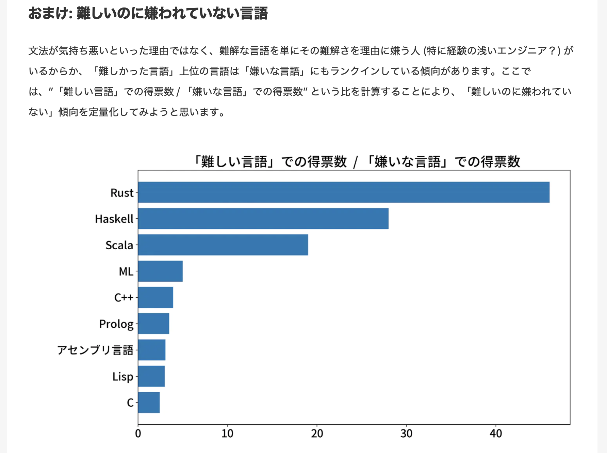

# 今日話すこと
1. Rustを選ぶときはいつか
2. あなたのプログラミングをより良くする3つのこと
3. Rustはなぜ爆速コーディングを可能にするのか

---

### 諸注意
今回のスライドは主観が多分に含まれています

---

# 余談

---

# 余談2

日本のユーザーが好きな言語・嫌いな言語 - Qiita
https://qiita.com/iwasaki501/items/51dc07b744d3f342008b

---

